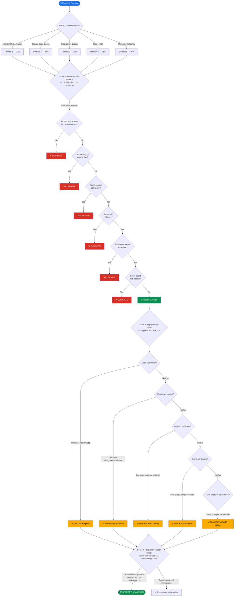
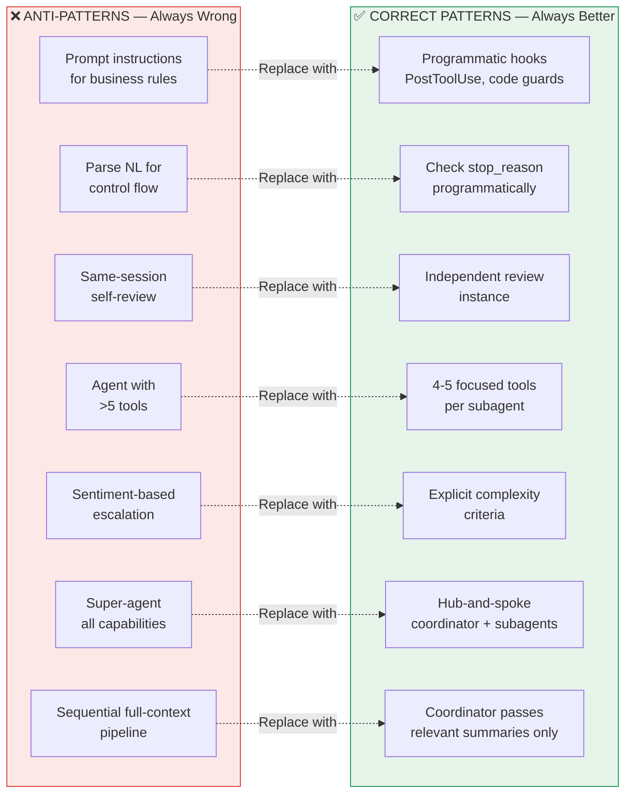
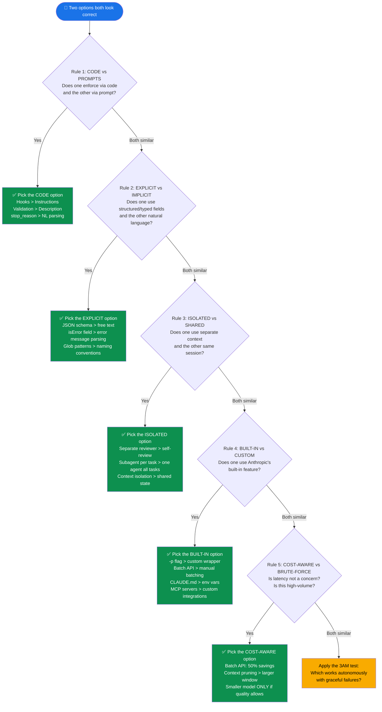
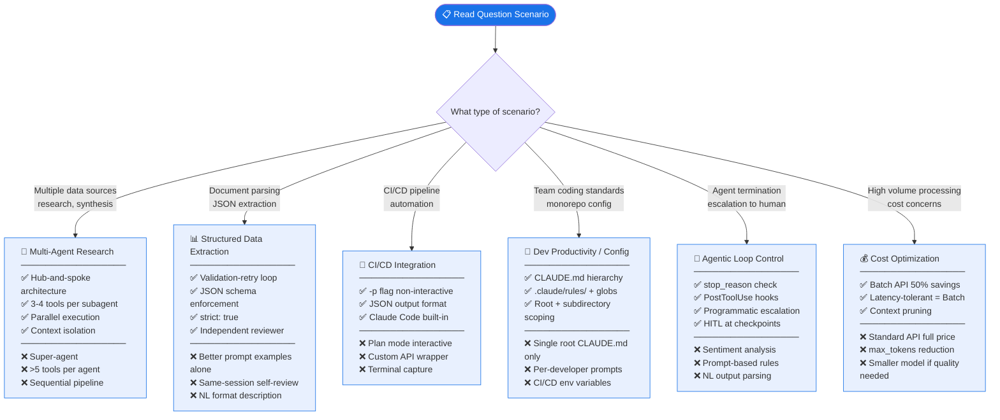
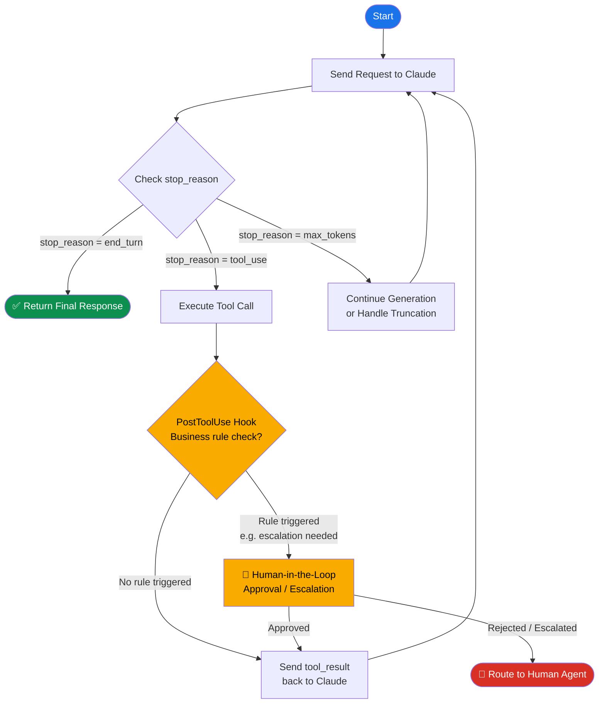
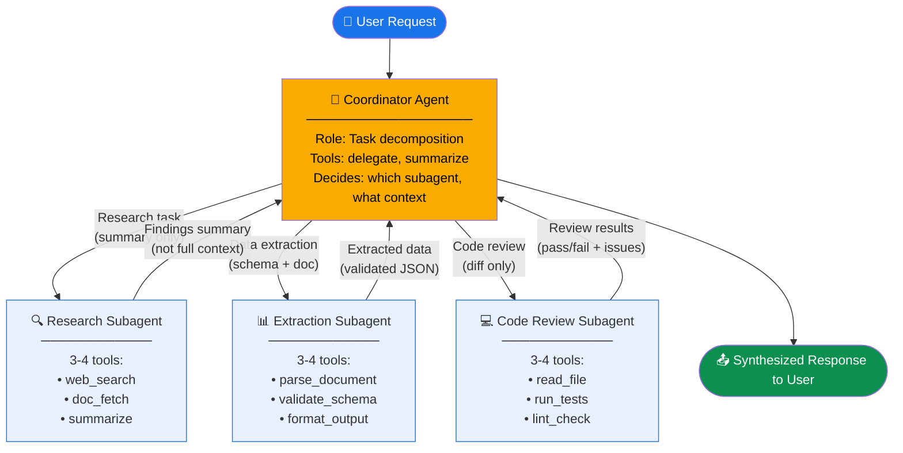

# CCA-F Decision Tree — Mermaid Diagrams

## How to View These Diagrams

These Mermaid diagrams can be rendered in:
- **VS Code**: Install the "Markdown Preview Mermaid Support" extension
- **GitHub**: Renders natively in `.md` files
- **Online**: Paste into [mermaid.live](https://mermaid.live)

---

## Diagram 1: Master Decision Algorithm

---

## Diagram 2: Anti-Pattern Recognition Quick Reference

---

## Diagram 3: Priority Rules — When 2 Options Both Look Correct

---

## Diagram 4: The 6 Exam Scenarios — What Pattern to Apply

---

## Diagram 5: The Agentic Loop — Core Mental Model (65% of the Exam)

---

## Diagram 6: Hub-and-Spoke Agent Architecture

---

*Render these diagrams in VS Code with the "Markdown Preview Mermaid Support" extension or paste into [mermaid.live](https://mermaid.live)*
